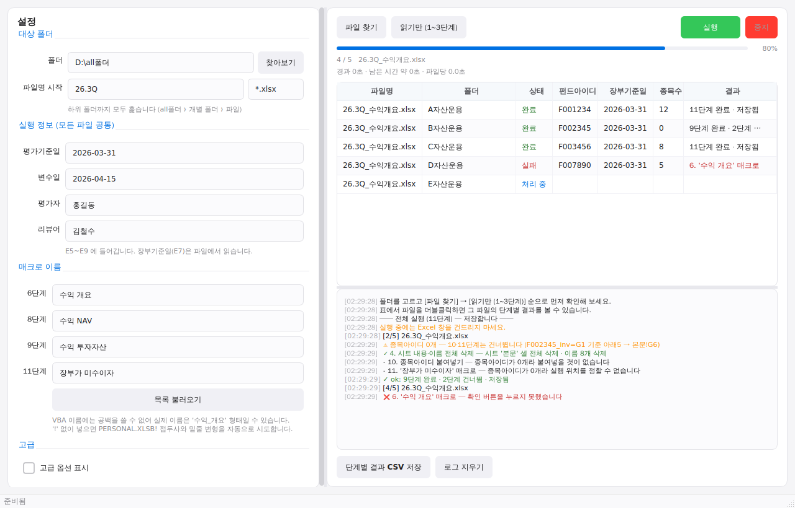

# 수익 보고서 생성 봇

전체 폴더 경로만 넣으면 하위 폴더를 하나씩 훑으며, 각 엑셀 파일에 대해
**펀드 정보 추출 → 시트 초기화 → 매크로 4개 실행 → 데이터 입력 → 저장**을 자동으로 반복합니다.

```
all폴더/
├── A자산운용/  26.3Q_....xlsx
├── B자산운용/  26.3Q_....xlsx
└── C자산운용/  26.3Q_....xlsx
```



## 11단계 흐름

| 단계 | 하는 일 |
|---|---|
| 1 | 이름 `F_1` → **아래 3 · 오른쪽 1** 칸에서 **펀드아이디** 읽기 |
| 2 | 이름 `{펀드아이디}_nav` → **아래 1 · 오른쪽 1** 칸에서 **장부기준일** 읽기 |
| 3 | 이름 `{펀드아이디}_inv` → **아래 5번째**부터 Ctrl+↓ 끝까지 **종목아이디** 수집 |
| 4 | `F_1` 이 있는 시트 **셀 전체 삭제**(Ctrl+A → 우클릭 → 삭제) + 이름 관리자의 모든 이름 삭제 |
| 5 | 숨겨진 시트 `ALT_ITEMS` 삭제 |
| 6 | `B2` 선택 → **수익 개요** 매크로 → 펀드아이디 입력 → **[생성]** |
| 7 | `E5:E9` 에 평가기준일 · 변수일 · **장부기준일** · 평가자 · 리뷰어 입력 |
| 8 | `B16` 선택 → **수익 NAV** 매크로 → 펀드아이디 입력 |
| 9 | `H16` 선택 → **수익 투자자산** 매크로 → 펀드아이디 입력 |
| 10 | `H21` 부터 아래로 종목아이디 붙여넣기 |
| 11 | 마지막 종목아이디 **아래 3칸** → **장부가 미수이자** 매크로 → 펀드아이디 입력 |

**1~3단계는 파일을 전혀 건드리지 않는 읽기 전용**입니다. 그래서 미리보기로 쓸 수 있습니다.

**종목아이디가 0개인 펀드**는 10·11단계만 건너뛰고 나머지는 그대로 진행해 저장합니다.
(수익 개요 · NAV · 투자자산 보고서는 만들어집니다)

## 설치와 실행

```cmd
git clone https://github.com/DalkomCandy/auto_setting.git
cd auto_setting
pip install -r requirements.txt
python main.py
```

`run_gui.bat` 을 더블클릭해도 됩니다. Python 3.9+, Windows, Excel 데스크톱이 필요합니다.

## 업데이트

새 버전이 나오면 클론해 둔 폴더에서:

```cmd
git pull
python main.py
```

**이것만으로 충분합니다.** 폴더 경로·매크로 파일 위치·매크로 이름·평가자 이름 같은 설정은
저장소 파일이 아니라 **사용자별 폴더의 JSON 파일**에 저장되므로 `git pull` 로 지워지거나
충돌하지 않습니다. `requirements.txt` 가 바뀐 경우(새 라이브러리 추가 등)에만
`pip install -r requirements.txt` 를 한 번 더 실행하면 됩니다.

### 설정이 저장되는 곳

화면 왼쪽 아래 **설정 파일** 줄에 정확한 경로가 표시됩니다(보통
`%APPDATA%\ExcelMacroBot\config.json`). **폴더 열기** 버튼으로 탐색기에서 바로 열 수
있고, 메모장으로 열어 내용을 확인하거나 다른 PC 로 복사해 설정을 그대로 옮길 수도
있습니다. Windows 레지스트리가 아니라 평범한 JSON 파일이라 사람이 읽고 고치기 쉽습니다.

---

# 오류가 어디서 났는지 확인하는 법

테스트 단계에서 가장 중요한 부분입니다. **세 군데에서 확인**할 수 있습니다.

### 1. 표의 `결과` 열 — 몇 단계에서 멈췄는지

```
26.3Q_수익개요.xlsx   C자산운용   실패   F005678   2026-03-31        3. 종목아이디 수집
26.3Q_수익개요.xlsx   D자산운용   실패   F007890   2026-03-31   5    6. '수익 개요' 매크로
```

### 2. 표를 더블클릭 — 그 파일의 11단계 전부

```
── C자산운용 / 26.3Q_수익개요.xlsx 단계별 결과 ──
  ✓ 1. F_1 에서 펀드아이디 읽기 — F005678 @ 본문!B4
  ✓ 2. 장부기준일 읽기 — 2026-03-31 @ 본문!E2
  ❌ 3. 종목아이디 수집 — 첫 종목아이디 칸이 비어 있습니다
       (F005678_inv=G1 기준 아래5 → 본문!G6)
  - 4. 시트 내용·이름 전체 삭제 — 이전 단계 실패로 중단
  ...
```

**실패 메시지에는 항상 「어떤 이름을 · 어느 셀에서 · 무슨 값을 읽었는지」가 들어갑니다.**
위치 설정이 틀린 건지, 파일이 이상한 건지 바로 구분할 수 있습니다.

### 3. 작업이 끝나면 실패한 단계별 집계

```
── 작업 종료: 완료 12 · 확인용 0 · 실패 3 ──
실패한 단계별 건수:
  3. 종목아이디 수집 — 2건
  6. '수익 개요' 매크로 — 1건
```

같은 단계에서 여러 건이 몰리면 파일 문제가 아니라 **설정 문제**일 가능성이 큽니다.

**[단계별 결과 CSV 저장]** 을 누르면 `파일 × 단계` 한 줄씩, 소요 시간까지 저장됩니다.

---

# 테스트 순서 — 이대로 해보세요

## 0단계. 매크로 파일 위치 지정 — **매크로 이름** 그룹의 **매크로 파일** 칸

매크로가 들어 있는 `.xlsb`/`.xlsm`/`.xlam` 파일의 정확한 경로를 여기에 직접 입력하세요.

> **비워두면 자동으로 추측하지 않고, `XLSTART\PERSONAL.XLSB` 딱 한 곳만 시도합니다.**
> 매크로가 그 위치에 없으면(다른 폴더, 네트워크 드라이브, 다른 파일명 등)
> 「매크로 파일을 찾을 수 없습니다」오류가 나며 그 경로가 로그에 그대로 표시됩니다.
> 그 경우 이 칸에 실제 위치를 지정하세요 — **찾기** 버튼으로 탐색기에서 골라도 됩니다.

## 1단계. 매크로 이름 확인 — [목록 불러오기]

Excel을 잠깐 열어 사용 가능한 매크로 이름을 읽어와 4개 드롭다운에 채웁니다.

> 빠른 실행 버튼에 `수익 개요`로 보여도 **VBA 프로시저 이름에는 공백을 쓸 수 없습니다.**
> 실제 이름은 `수익_개요`일 가능성이 큽니다.
>
> **이름을 자동으로 추측하지 않습니다.** 입력한 이름을 그대로 실행하므로,
> [목록 불러오기]로 확인한 정확한 전체 이름(예: `PERSONAL.XLSB!수익_개요`)을
> 그대로 입력하세요. 잘못된 이름을 입력하면 그 자리에서 바로 오류로 알려줍니다.

<details>
<summary>「VBA 프로젝트에 접근할 수 없습니다」가 나오면</summary>

Excel → **파일 → 옵션 → 보안 센터 → 보안 센터 설정 → 매크로 설정**에서
**「VBA 프로젝트 개체 모델에 안전하게 접근할 수 있음」**을 체크하세요.
또는 Alt+F11 로 직접 확인해 손으로 입력해도 됩니다.
</details>

## 2단계. [파일 찾기]

폴더를 고르고 누르면 대상 파일이 표에 나열됩니다. 폴더 칸에는 **드래그앤드롭**도 됩니다.

## 3단계. [읽기만 (1~3단계)] ← 가장 중요

**파일을 전혀 수정하지 않고** 펀드아이디 · 장부기준일 · 종목수만 읽어 표에 채웁니다.

```
26.3Q_수익개요.xlsx   A자산운용   확인용   F001234   2026-03-31   12
```

여기서 값이 다 맞게 나오면 **1~3단계의 위치 설정이 옳다는 뜻**입니다.
틀리면 고급에서 위치를 조정하세요 (아래 표 참고).

## 4단계. 파일 1개로 전체 실행

**고급 › 처리 개수 제한**을 `1` 로 두고 **[실행]**.
잘 되면 제한을 풀고 전체를 돌리세요.

> **중간까지만 테스트하기**
> **고급 › 실행 범위**를 `6` 으로 두면 6단계까지만 실행하고 **저장하지 않습니다.**
> 매크로가 제대로 도는지만 확인하고 싶을 때 유용합니다.

---

# 잘 안 될 때

## 펀드아이디를 잘못 읽음 / 「F 로 시작하지 않습니다」

1단계 실패 메시지에 실제로 읽은 값과 셀 주소가 나옵니다.
**고급 › 펀드아이디 이름 · 위치**에서 `F_1` 과 아래/오른쪽 칸 수를 조정하세요.

## 매크로 창의 엉뚱한 칸에 펀드아이디가 들어감

「수익 개요」 창에는 입력칸이 둘(`SELECT RANGE` + `펀드아이디`)입니다.
봇은 기본적으로 **비어 있는 첫 칸**을 고릅니다 — `SELECT RANGE` 에는 이미 `$B$2` 가 채워져 있으니까요.

그래도 틀리면 **고급 › 입력칸 선택**을 `0`, `1`, `2`… 로 직접 지정하세요.

## 창 구조를 직접 보고 싶다

CLI 진단 도구로 매크로가 띄우는 창의 컨트롤 구조를 덤프할 수 있습니다 (저장하지 않음).

```cmd
python excel_macro_bot.py --root "D:\all폴더" --macro "PERSONAL.XLSB!수익_개요" --probe --limit 1
```

```
  창 제목 : '수익 개요'
  클래스  : #32770
    EDIT   cls=RefEdit20  id=1001  text='$B$2'      ← SELECT RANGE
    EDIT   cls=Edit       id=1002  text=''          ← 펀드아이디 (여기에 입력)
    BUTTON cls=Button     id=1     text='생성'
    BUTTON cls=Button     id=2     text='취소'
```

창이 여러 개 뜨면 **고급 › 창 제목 필터**로 좁히세요.

## 입력칸에 값이 안 들어감

**고급 › 입력 방식**을 `타이핑 (한 글자씩)` 으로 바꿔보세요.
일부 컨트롤은 `WM_SETTEXT` 를 무시합니다.

---

# 고급 — 위치 설정

파일 양식이 바뀌면 코드를 고치지 않고 여기서 맞출 수 있습니다.

| 항목 | 기본값 | 설명 |
|---|---|---|
| 펀드아이디 이름 | `F_1` | 기준이 되는 이름 |
| ↳ 위치 | 아래 `3` · 오른쪽 `1` | 기준 이름에서의 오프셋 |
| ↳ 시작 글자 | `F` | 안 맞으면 위치 오류로 판단. 비우면 검사 안 함 |
| 장부기준일 접미사 | `_nav` | `{펀드아이디}_nav` |
| ↳ 위치 | 아래 `1` · 오른쪽 `1` | |
| 종목 목록 접미사 | `_inv` | `{펀드아이디}_inv` |
| ↳ 첫 종목 | 아래 `5` | 여기부터 Ctrl+↓ 끝까지 수집 |
| 삭제할 시트 | `ALT_ITEMS` | 없으면 건너뜁니다 |
| 4단계 방식 | 셀 전체 삭제 | `Ctrl+A → 삭제` / `내용·서식만 지우기` |
| 셀 위치 | 개요 `B2` · 정보 `E5` · NAV `B16` · 투자자산 `H16` · 종목 `H21` | |
| 미수이자 | 마지막 종목 아래 `3` | |
| 실행 범위 | 전체 | N 단계까지만 실행하고 저장 안 함 |
| 입력칸 선택 | 자동 | 대화상자에서 몇 번째 칸에 펀드아이디를 넣을지 |

설정은 자동으로 저장되어 다음 실행 때 복원됩니다.

---

# 세부 동작

- **4단계 시트 비우기** → `Cells.Delete()`, 즉 **Ctrl+A → 우클릭 → 삭제**와 같습니다.
  셀 자체가 사라지므로 병합·조건부서식·유효성검사까지 정리됩니다.
  값과 서식만 지우려면 **고급 › 4단계 방식**을 `내용·서식만 지우기` 로 바꾸세요.
- **종목아이디 0개** → 정상으로 보고 **10·11단계만 건너뜁니다.**
  나머지 단계는 그대로 진행하고 저장하며, 결과에 `9단계 완료 · 2단계 건너뜀 · 저장됨` 으로 남습니다.

아래는 명세에 없어서 제가 정한 부분입니다. 다르면 알려주세요.

- **이름 삭제** → `Print_Area` 같은 **내장 이름은 삭제되지 않을 수 있습니다.**
  이 경우 실패 처리하지 않고 로그에 "삭제 안 됨 N개"로 남깁니다.
- **장부기준일** → 시트에서 읽어 `yyyy-mm-dd` 문자열로 바꿔 E7 에 씁니다.
- **종목아이디 붙여넣기** → 문자열이 하나라도 있으면 대상 칸을 **텍스트 서식**으로 지정해
  `005930` 의 앞자리 0 이 사라지지 않게 합니다.
- **저장** → 11단계가 **모두 성공했을 때만** 저장합니다.
  실패하면 원본 그대로 남으므로 원인을 고친 뒤 다시 돌리면 됩니다.

---

# 주의사항

- **실행 전에 Excel 을 모두 닫으세요.** 봇은 자동화 전용 Excel 인스턴스를 새로 띄웁니다.
- **실행 중에는 화면이 흰색으로 덮입니다.** Excel 이 셀을 선택하고 매크로 창을 열고 닫는 과정이
  다른 사람 눈에 노출되지 않게 하고, 실수로 그 위를 클릭해 자동화를 방해하지 않도록 하기
  위해서입니다. 흰 화면 위에도 진행 상황과 **[중지]** 버튼은 그대로 보이고,
  **Esc** 를 누르면 가리기만 풀립니다(작업은 계속 진행됩니다).
- **파일을 덮어쓰기 저장하고, 시트와 이름을 전부 지웁니다.** 반드시 백업 후 사용하세요.
- **[중지]** 는 지금 처리 중인 파일까지 끝내고 멈춥니다.
- 매크로가 **대화상자도 없이 멈추면** 봇이 개입할 수 없습니다. 작업 관리자에서 Excel 을 종료하세요.
  대화상자가 떴는데 처리에 실패한 경우에는 봇이 창을 취소하고 그 단계를 실패로 기록합니다.

---

# 파일 구성

| 파일 | 역할 |
|---|---|
| `main.py` | GUI 진입점 |
| `fund_pipeline.py` | **11단계 파이프라인** (단계별 실행·오류 보고) |
| `excel_macro_bot.py` | 공용 엔진 (Excel 실행, 매크로 이름 해석, 대화상자 감시) + 진단 CLI |
| `win_dialog.py` | Win32 창/컨트롤 조작 (입력칸 선택, 버튼 클릭) |
| `gui/window.py` | 메인 윈도우 |
| `gui/worker.py` | 백그라운드 스레드 (스캔 / 매크로 목록 / 파이프라인) |
| `gui/widgets.py` | 콘솔·진행률·폴더 입력 위젯 + 설정 JSON 저장소 |
| `gui/overlay.py` | 처리 중 화면을 흰색으로 덮는 오버레이 |
| `gui/style.qss` | 스타일시트 |
| `run_gui.bat` | GUI 실행 |
| `run.bat` | 진단 CLI 실행 (매크로 목록 / 창 구조 확인). 값은 파일을 고치지 않고 인자로 받습니다 |

`Python` 저장소의 `Auto_Tools`(업무 자동화 매니저)와는 완전히 독립된 프로그램입니다.

## 동작 원리 — InputBox 를 어떻게 채우나

VBA 의 `InputBox` 는 **모달 창**이라, 창이 떠 있는 동안 `Application.Run` 이 반환되지 않습니다.
그래서 COM 호출만으로는 그 창을 채울 수 없습니다.

매크로를 실행하기 **직전에 감시 스레드**를 띄워 해결했습니다.

```
메인 스레드                          감시 스레드
─────────────                        ─────────────
B2 선택
감시 스레드 시작  ──────────────────▶  Excel 프로세스의 창을 폴링
Application.Run(매크로)  ← 블로킹        │
   │                                    ├─ 창 발견
   │  (입력창 떠 있음)                  ├─ 비어 있는 입력칸에 펀드아이디
   │                                    └─ [생성] 클릭
   ▼                                          │
반환됨  ◀───────────────────────────────────────┘
다음 단계
```

GUI 에서는 이 전체가 다시 백그라운드 스레드에서 돌아가므로 창이 멈추지 않습니다.
